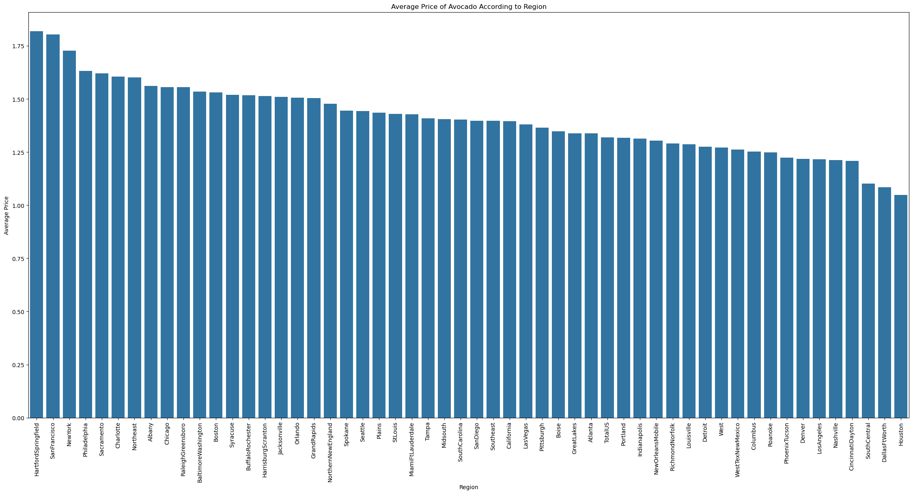

```python
# importing fo read 
import pandas as pd
import numpy as np

#Importing tools for visualization 
import matplotlib
import matplotlib.pyplot as plt 
import seaborn as sns

#Import evaluation metric librarie s
from sklearn import metrics
from sklearn.metrics import confusion_matrix, accuracy_score, precision_score, recall_score, f1_score, classification_report 
from sklearn.preprocessing import LabelEncoder

#Libraries used for data  prprocessing 
from sklearn.model_selection import train_test_split
from sklearn.model_selection import GridSearchCV

# Import ML models
from sklearn.linear_model import LinearRegression
from sklearn.tree import DecisionTreeRegressor
from sklearn.ensemble import RandomForestRegressor
import xgboost as xgb
from xgboost import XGBRegressor

#librries used for ignore warnings 
import warnings
warnings.filterwarnings('ignore')
warnings.filterwarnings("ignore",category=DeprecationWarning)
%matplotlib inline

import joblib
```


```python
avo=pd.read_csv(r"C:\Users\lakshita\Desktop\datasets\avocado_full.csv")

print("Successfully Imported Data!")
```

    Successfully Imported Data!
    


```python
avo.head()
```


<div>
<style scoped>
    .dataframe tbody tr th:only-of-type {
        vertical-align: middle;
    }

    .dataframe tbody tr th {
        vertical-align: top;
    }

    .dataframe thead th {
        text-align: right;
    }
</style>
<table border="1" class="dataframe">
  <thead>
    <tr style="text-align: right;">
      <th></th>
      <th>Date</th>
      <th>AveragePrice</th>
      <th>Total Volume</th>
      <th>4046</th>
      <th>4225</th>
      <th>4770</th>
      <th>Total Bags</th>
      <th>Small Bags</th>
      <th>Large Bags</th>
      <th>XLarge Bags</th>
      <th>type</th>
      <th>year</th>
      <th>region</th>
    </tr>
  </thead>
  <tbody>
    <tr>
      <th>0</th>
      <td>2015-12-27</td>
      <td>1.33</td>
      <td>64236.62</td>
      <td>1036.74</td>
      <td>54454.85</td>
      <td>48.16</td>
      <td>8696.87</td>
      <td>8603.62</td>
      <td>93.25</td>
      <td>0.0</td>
      <td>conventional</td>
      <td>2015</td>
      <td>Albany</td>
    </tr>
    <tr>
      <th>1</th>
      <td>2015-12-20</td>
      <td>1.35</td>
      <td>54876.98</td>
      <td>674.28</td>
      <td>44638.81</td>
      <td>58.33</td>
      <td>9505.56</td>
      <td>9408.07</td>
      <td>97.49</td>
      <td>0.0</td>
      <td>conventional</td>
      <td>2015</td>
      <td>Albany</td>
    </tr>
    <tr>
      <th>2</th>
      <td>2015-12-13</td>
      <td>0.93</td>
      <td>118220.22</td>
      <td>794.70</td>
      <td>109149.67</td>
      <td>130.50</td>
      <td>8145.35</td>
      <td>8042.21</td>
      <td>103.14</td>
      <td>0.0</td>
      <td>conventional</td>
      <td>2015</td>
      <td>Albany</td>
    </tr>
    <tr>
      <th>3</th>
      <td>2015-12-06</td>
      <td>1.08</td>
      <td>78992.15</td>
      <td>1132.00</td>
      <td>71976.41</td>
      <td>72.58</td>
      <td>5811.16</td>
      <td>5677.40</td>
      <td>133.76</td>
      <td>0.0</td>
      <td>conventional</td>
      <td>2015</td>
      <td>Albany</td>
    </tr>
    <tr>
      <th>4</th>
      <td>2015-11-29</td>
      <td>1.28</td>
      <td>51039.60</td>
      <td>941.48</td>
      <td>43838.39</td>
      <td>75.78</td>
      <td>6183.95</td>
      <td>5986.26</td>
      <td>197.69</td>
      <td>0.0</td>
      <td>conventional</td>
      <td>2015</td>
      <td>Albany</td>
    </tr>
  </tbody>
</table>
</div>


```python
avo.shape
```


    (18249, 13)


```python
avo.info()
```

    <class 'pandas.core.frame.DataFrame'>
    RangeIndex: 18249 entries, 0 to 18248
    Data columns (total 13 columns):
     #   Column        Non-Null Count  Dtype  
    ---  ------        --------------  -----  
     0   Date          18249 non-null  object 
     1   AveragePrice  18249 non-null  float64
     2   Total Volume  18249 non-null  float64
     3   4046          18249 non-null  float64
     4   4225          18249 non-null  float64
     5   4770          18249 non-null  float64
     6   Total Bags    18249 non-null  float64
     7   Small Bags    18249 non-null  float64
     8   Large Bags    18249 non-null  float64
     9   XLarge Bags   18249 non-null  float64
     10  type          18249 non-null  object 
     11  year          18249 non-null  int64  
     12  region        18249 non-null  object 
    dtypes: float64(9), int64(1), object(3)
    memory usage: 1.8+ MB
    


```python
avo.describe()
```


<div>
<style scoped>
    .dataframe tbody tr th:only-of-type {
        vertical-align: middle;
    }

    .dataframe tbody tr th {
        vertical-align: top;
    }

    .dataframe thead th {
        text-align: right;
    }
</style>
<table border="1" class="dataframe">
  <thead>
    <tr style="text-align: right;">
      <th></th>
      <th>AveragePrice</th>
      <th>Total Volume</th>
      <th>4046</th>
      <th>4225</th>
      <th>4770</th>
      <th>Total Bags</th>
      <th>Small Bags</th>
      <th>Large Bags</th>
      <th>XLarge Bags</th>
      <th>year</th>
    </tr>
  </thead>
  <tbody>
    <tr>
      <th>count</th>
      <td>18249.000000</td>
      <td>1.824900e+04</td>
      <td>1.824900e+04</td>
      <td>1.824900e+04</td>
      <td>1.824900e+04</td>
      <td>1.824900e+04</td>
      <td>1.824900e+04</td>
      <td>1.824900e+04</td>
      <td>18249.000000</td>
      <td>18249.000000</td>
    </tr>
    <tr>
      <th>mean</th>
      <td>1.405978</td>
      <td>8.506440e+05</td>
      <td>2.930084e+05</td>
      <td>2.951546e+05</td>
      <td>2.283974e+04</td>
      <td>2.396392e+05</td>
      <td>1.821947e+05</td>
      <td>5.433809e+04</td>
      <td>3106.426507</td>
      <td>2016.147899</td>
    </tr>
    <tr>
      <th>std</th>
      <td>0.402677</td>
      <td>3.453545e+06</td>
      <td>1.264989e+06</td>
      <td>1.204120e+06</td>
      <td>1.074641e+05</td>
      <td>9.862424e+05</td>
      <td>7.461785e+05</td>
      <td>2.439660e+05</td>
      <td>17692.894652</td>
      <td>0.939938</td>
    </tr>
    <tr>
      <th>min</th>
      <td>0.440000</td>
      <td>8.456000e+01</td>
      <td>0.000000e+00</td>
      <td>0.000000e+00</td>
      <td>0.000000e+00</td>
      <td>0.000000e+00</td>
      <td>0.000000e+00</td>
      <td>0.000000e+00</td>
      <td>0.000000</td>
      <td>2015.000000</td>
    </tr>
    <tr>
      <th>25%</th>
      <td>1.100000</td>
      <td>1.083858e+04</td>
      <td>8.540700e+02</td>
      <td>3.008780e+03</td>
      <td>0.000000e+00</td>
      <td>5.088640e+03</td>
      <td>2.849420e+03</td>
      <td>1.274700e+02</td>
      <td>0.000000</td>
      <td>2015.000000</td>
    </tr>
    <tr>
      <th>50%</th>
      <td>1.370000</td>
      <td>1.073768e+05</td>
      <td>8.645300e+03</td>
      <td>2.906102e+04</td>
      <td>1.849900e+02</td>
      <td>3.974383e+04</td>
      <td>2.636282e+04</td>
      <td>2.647710e+03</td>
      <td>0.000000</td>
      <td>2016.000000</td>
    </tr>
    <tr>
      <th>75%</th>
      <td>1.660000</td>
      <td>4.329623e+05</td>
      <td>1.110202e+05</td>
      <td>1.502069e+05</td>
      <td>6.243420e+03</td>
      <td>1.107834e+05</td>
      <td>8.333767e+04</td>
      <td>2.202925e+04</td>
      <td>132.500000</td>
      <td>2017.000000</td>
    </tr>
    <tr>
      <th>max</th>
      <td>3.250000</td>
      <td>6.250565e+07</td>
      <td>2.274362e+07</td>
      <td>2.047057e+07</td>
      <td>2.546439e+06</td>
      <td>1.937313e+07</td>
      <td>1.338459e+07</td>
      <td>5.719097e+06</td>
      <td>551693.650000</td>
      <td>2018.000000</td>
    </tr>
  </tbody>
</table>
</div>


```python
avo.tail()
```


<div>
<style scoped>
    .dataframe tbody tr th:only-of-type {
        vertical-align: middle;
    }

    .dataframe tbody tr th {
        vertical-align: top;
    }

    .dataframe thead th {
        text-align: right;
    }
</style>
<table border="1" class="dataframe">
  <thead>
    <tr style="text-align: right;">
      <th></th>
      <th>Date</th>
      <th>AveragePrice</th>
      <th>Total Volume</th>
      <th>4046</th>
      <th>4225</th>
      <th>4770</th>
      <th>Total Bags</th>
      <th>Small Bags</th>
      <th>Large Bags</th>
      <th>XLarge Bags</th>
      <th>type</th>
      <th>year</th>
      <th>region</th>
    </tr>
  </thead>
  <tbody>
    <tr>
      <th>18244</th>
      <td>2018-02-04</td>
      <td>1.63</td>
      <td>17074.83</td>
      <td>2046.96</td>
      <td>1529.20</td>
      <td>0.00</td>
      <td>13498.67</td>
      <td>13066.82</td>
      <td>431.85</td>
      <td>0.0</td>
      <td>organic</td>
      <td>2018</td>
      <td>WestTexNewMexico</td>
    </tr>
    <tr>
      <th>18245</th>
      <td>2018-01-28</td>
      <td>1.71</td>
      <td>13888.04</td>
      <td>1191.70</td>
      <td>3431.50</td>
      <td>0.00</td>
      <td>9264.84</td>
      <td>8940.04</td>
      <td>324.80</td>
      <td>0.0</td>
      <td>organic</td>
      <td>2018</td>
      <td>WestTexNewMexico</td>
    </tr>
    <tr>
      <th>18246</th>
      <td>2018-01-21</td>
      <td>1.87</td>
      <td>13766.76</td>
      <td>1191.92</td>
      <td>2452.79</td>
      <td>727.94</td>
      <td>9394.11</td>
      <td>9351.80</td>
      <td>42.31</td>
      <td>0.0</td>
      <td>organic</td>
      <td>2018</td>
      <td>WestTexNewMexico</td>
    </tr>
    <tr>
      <th>18247</th>
      <td>2018-01-14</td>
      <td>1.93</td>
      <td>16205.22</td>
      <td>1527.63</td>
      <td>2981.04</td>
      <td>727.01</td>
      <td>10969.54</td>
      <td>10919.54</td>
      <td>50.00</td>
      <td>0.0</td>
      <td>organic</td>
      <td>2018</td>
      <td>WestTexNewMexico</td>
    </tr>
    <tr>
      <th>18248</th>
      <td>2018-01-07</td>
      <td>1.62</td>
      <td>17489.58</td>
      <td>2894.77</td>
      <td>2356.13</td>
      <td>224.53</td>
      <td>12014.15</td>
      <td>11988.14</td>
      <td>26.01</td>
      <td>0.0</td>
      <td>organic</td>
      <td>2018</td>
      <td>WestTexNewMexico</td>
    </tr>
  </tbody>
</table>
</div>


```python
# Correcting the use of iris.info()
print(avo.info())
print("Number of rows ", avo.shape[0])
print("Number of Columns ",avo.shape[1])
print(avo.head(150))
```

    <class 'pandas.core.frame.DataFrame'>
    RangeIndex: 18249 entries, 0 to 18248
    Data columns (total 13 columns):
     #   Column        Non-Null Count  Dtype  
    ---  ------        --------------  -----  
     0   Date          18249 non-null  object 
     1   AveragePrice  18249 non-null  float64
     2   Total Volume  18249 non-null  float64
     3   4046          18249 non-null  float64
     4   4225          18249 non-null  float64
     5   4770          18249 non-null  float64
     6   Total Bags    18249 non-null  float64
     7   Small Bags    18249 non-null  float64
     8   Large Bags    18249 non-null  float64
     9   XLarge Bags   18249 non-null  float64
     10  type          18249 non-null  object 
     11  year          18249 non-null  int64  
     12  region        18249 non-null  object 
    dtypes: float64(9), int64(1), object(3)
    memory usage: 1.8+ MB
    None
    Number of rows  18249
    Number of Columns  13
               Date  AveragePrice  Total Volume      4046       4225      4770  \
    0    2015-12-27          1.33      64236.62   1036.74   54454.85     48.16   
    1    2015-12-20          1.35      54876.98    674.28   44638.81     58.33   
    2    2015-12-13          0.93     118220.22    794.70  109149.67    130.50   
    3    2015-12-06          1.08      78992.15   1132.00   71976.41     72.58   
    4    2015-11-29          1.28      51039.60    941.48   43838.39     75.78   
    ..          ...           ...           ...       ...        ...       ...   
    145  2015-03-15          1.24     693698.13  53400.14  395837.01  46596.22   
    146  2015-03-08          1.26     657745.90  55284.80  367670.93  42267.91   
    147  2015-03-01          1.16     770115.24  59039.85  498872.67  40241.65   
    148  2015-02-22          1.11     749845.79  50501.07  445970.56  62611.61   
    149  2015-02-15          1.25     637319.34  49751.74  361677.37  45900.05   
    
         Total Bags  Small Bags  Large Bags  XLarge Bags          type  year  \
    0       8696.87     8603.62       93.25          0.0  conventional  2015   
    1       9505.56     9408.07       97.49          0.0  conventional  2015   
    2       8145.35     8042.21      103.14          0.0  conventional  2015   
    3       5811.16     5677.40      133.76          0.0  conventional  2015   
    4       6183.95     5986.26      197.69          0.0  conventional  2015   
    ..          ...         ...         ...          ...           ...   ...   
    145   197864.76   193130.90     4733.86          0.0  conventional  2015   
    146   192522.26   188374.49     4147.77          0.0  conventional  2015   
    147   171961.07   168224.20     3736.87          0.0  conventional  2015   
    148   190762.55   186976.97     3785.58          0.0  conventional  2015   
    149   179990.18   174864.87     5125.31          0.0  conventional  2015   
    
                      region  
    0                 Albany  
    1                 Albany  
    2                 Albany  
    3                 Albany  
    4                 Albany  
    ..                   ...  
    145  BaltimoreWashington  
    146  BaltimoreWashington  
    147  BaltimoreWashington  
    148  BaltimoreWashington  
    149  BaltimoreWashington  
    
    [150 rows x 13 columns]
    


```python
dup = avo.duplicated().sum()
print(f'Number of duplicate rows: {dup}')
```

    Number of duplicate rows: 0
    


```python
# Dropping duplicate rows
avo=avo.drop_duplicates()
```


```python
# Checking the number of rows again to see if duplicates were dropped
print(f'Number of rows after dropping duplicates: {avo.shape[0]}')
```

    Number of rows after dropping duplicates: 18249
    


```python
print(avo.isna().sum())
```

    Date            0
    AveragePrice    0
    Total Volume    0
    4046            0
    4225            0
    4770            0
    Total Bags      0
    Small Bags      0
    Large Bags      0
    XLarge Bags     0
    type            0
    year            0
    region          0
    dtype: int64
    


```python
#exclude nin - numeric columns
numeric_df=avo.select_dtypes(include=[np.number])

#calculation the correlation
correlation_matrix=numeric_df.corr()
print(correlation_matrix)
```

                  AveragePrice  Total Volume      4046      4225      4770  \
    AveragePrice      1.000000     -0.192752 -0.208317 -0.172928 -0.179446   
    Total Volume     -0.192752      1.000000  0.977863  0.974181  0.872202   
    4046             -0.208317      0.977863  1.000000  0.926110  0.833389   
    4225             -0.172928      0.974181  0.926110  1.000000  0.887855   
    4770             -0.179446      0.872202  0.833389  0.887855  1.000000   
    Total Bags       -0.177088      0.963047  0.920057  0.905787  0.792314   
    Small Bags       -0.174730      0.967238  0.925280  0.916031  0.802733   
    Large Bags       -0.172940      0.880640  0.838645  0.810015  0.698471   
    XLarge Bags      -0.117592      0.747157  0.699377  0.688809  0.679861   
    year              0.093197      0.017193  0.003353 -0.009559 -0.036531   
    
                  Total Bags  Small Bags  Large Bags  XLarge Bags      year  
    AveragePrice   -0.177088   -0.174730   -0.172940    -0.117592  0.093197  
    Total Volume    0.963047    0.967238    0.880640     0.747157  0.017193  
    4046            0.920057    0.925280    0.838645     0.699377  0.003353  
    4225            0.905787    0.916031    0.810015     0.688809 -0.009559  
    4770            0.792314    0.802733    0.698471     0.679861 -0.036531  
    Total Bags      1.000000    0.994335    0.943009     0.804233  0.071552  
    Small Bags      0.994335    1.000000    0.902589     0.806845  0.063915  
    Large Bags      0.943009    0.902589    1.000000     0.710858  0.087891  
    XLarge Bags     0.804233    0.806845    0.710858     1.000000  0.081033  
    year            0.071552    0.063915    0.087891     0.081033  1.000000  
    


```python
# Check for non-numeric columns
non_numeric_columns = avo.select_dtypes(include=['object']).columns

# Display non-numeric columns and their data
print("Non-numeric columns and their data:\n", avo[non_numeric_columns].head())

# Optionally, drop or convert these columns before aggregation
avo_numeric = avo.apply(pd.to_numeric, errors='coerce')

# Now perform your aggregation
a=avo_numeric.groupby('region').mean()
print(a)
```

    Non-numeric columns and their data:
              Date          type  region
    0  2015-12-27  conventional  Albany
    1  2015-12-20  conventional  Albany
    2  2015-12-13  conventional  Albany
    3  2015-12-06  conventional  Albany
    4  2015-11-29  conventional  Albany
    Empty DataFrame
    Columns: [Date, AveragePrice, Total Volume, 4046, 4225, 4770, Total Bags, Small Bags, Large Bags, XLarge Bags, type, year]
    Index: []
    

# analysis


```python
region_list=list(avo.region.unique())
average_price=[]

for i in region_list:
    x=avo[avo.region==i]
    region_average=sum(x.AveragePrice)/len(x)
    average_price.append(region_average)

avo1=pd.DataFrame({'region_list':region_list,'average_price':average_price})
new_index=avo1.average_price.sort_values(ascending=False).index.values
sorted_data=avo1.reindex(new_index)

plt.figure(figsize=(28,13))
ax=sns.barplot(x=sorted_data.region_list,y=sorted_data.average_price)

plt.xticks(rotation=90)
plt.xlabel('Region')
plt.ylabel('Average Price')
plt.title('Average Price of Avocado According to Region')
```


    Text(0.5, 1.0, 'Average Price of Avocado According to Region')


    

    


```python
filter1=avo.region!='TotalUS'
avo1=avo[filter1]

region_list=list(avo1.region.unique())
average_total_volume=[]

for i in region_list:
    x=avo1[avo1.region==i]
    average_total_volume.append(sum(x['Total Volume'])/len(x))
avo3=pd.DataFrame({'region_list':region_list,'average_total_volume':average_total_volume})

new_index=avo3.average_total_volume.sort_values(ascending=False).index.values
sorted_data1=avo3.reindex(new_index)

plt.figure(figsize=(22,10))
ax=sns.barplot(x=sorted_data1.region_list,y=sorted_data1.average_total_volume)

plt.xticks(rotation=90)
plt.xlabel('Region')
plt.ylabel('Average of Total Volume')
plt.title('Average of Total Volume According to Region')
```


    Text(0.5, 1.0, 'Average of Total Volume According to Region')


    


    


```python
avo.columns
```


    Index(['Date', 'AveragePrice', 'Total Volume', '4046', '4225', '4770',
           'Total Bags', 'Small Bags', 'Large Bags', 'XLarge Bags', 'type', 'year',
           'region'],
          dtype='object')


```python
print(avo.dtypes)

```

    Date             object
    AveragePrice    float64
    Total Volume    float64
    4046            float64
    4225            float64
    4770            float64
    Total Bags      float64
    Small Bags      float64
    Large Bags      float64
    XLarge Bags     float64
    type             object
    year              int64
    region           object
    dtype: object
    


```python
plt.figure(figsize=(12, 6))
sns.lineplot(x='year', y='AveragePrice', data=avo, marker="o")
plt.title('Average Price of Avocados Across Years by Region')
plt.xlabel('Year')
plt.ylabel('Average Price')
plt.show()
```


    


    


```python
plt.figure(figsize=(10, 6))
sns.histplot(avo['Large Bags'], bins=20, kde=True, color="orange")
plt.title('Avocado Large Bags Distribution')
plt.xlabel('XLarge Bags')
plt.ylabel('Count')
plt.show()

```


    


    


```python
plt.figure(figsize=(10, 6))
sns.boxplot(x=avo['XLarge Bags'], color='purple')
plt.title('Avocado XLarge Bags Box Plot')
plt.xlabel('XLarge Bags')
plt.show()

```


    


    


```python
plt.figure(figsize=(10, 6))
sns.boxplot(x=avo['Small Bags'], color="purple")
plt.title('Avocado Small Bags Box Plot')
plt.xlabel('Number of Small Bags')
plt.show()

```


    


    


```python
sns.set(font_scale=1.5) 
from scipy.stats import norm
fig, ax = plt.subplots(figsize=(15, 9))
sns.distplot(a=avo.AveragePrice, kde=False, fit=norm)
```


    <Axes: xlabel='AveragePrice'>


    


    


```python
plt.figure(figsize=(10,7))
sns.lineplot(x="year", y="AveragePrice", hue='type', data=avo)
plt.title('Yearly Average Price of Avocados')
plt.xlabel('Year')
plt.ylabel('Average Price')
plt.show()

```


    


    


# Pair plot for visualizing relationships between all features


```python
sns.pairplot(avo, hue='type')
plt.show()
```


    


    


```python
plt.figure(figsize=(19,18))  # Control figure size
g = sns.scatterplot(
    x='AveragePrice',
    y='region',
    data=avo,
    hue='year',
    palette='Blues'
)
plt.show()

```


    


    


```python
byDate = avo.groupby('Date').mean(numeric_only=True)

plt.figure(figsize=(12, 8))
byDate['AveragePrice'].plot()
plt.title('Average Price Over Time')
plt.xlabel('Date')
plt.ylabel('Average Price')
plt.show()
```


    


    


```python
numeric_cols = avo.select_dtypes(include=['float64', 'int64'])
plt.figure(figsize=(12, 6))
sns.heatmap(numeric_cols.corr(), cmap='coolwarm', annot=True)
plt.title('Correlation Heatmap of Numeric Features')
plt.show()
```


    


    


```python
print("region nunique")
avo['region'].nunique()

```

    region nunique
    


    54


```python
print("type nunique")
avo['type'].nunique()
```

    type nunique
    


    2


```python
avo_final=pd.get_dummies(avo.drop(['region','Date'],axis=1),drop_first=True)
```


```python
avo_final.head()
```


<div>
<style scoped>
    .dataframe tbody tr th:only-of-type {
        vertical-align: middle;
    }

    .dataframe tbody tr th {
        vertical-align: top;
    }

    .dataframe thead th {
        text-align: right;
    }
</style>
<table border="1" class="dataframe">
  <thead>
    <tr style="text-align: right;">
      <th></th>
      <th>AveragePrice</th>
      <th>Total Volume</th>
      <th>4046</th>
      <th>4225</th>
      <th>4770</th>
      <th>Total Bags</th>
      <th>Small Bags</th>
      <th>Large Bags</th>
      <th>XLarge Bags</th>
      <th>year</th>
      <th>type_organic</th>
    </tr>
  </thead>
  <tbody>
    <tr>
      <th>0</th>
      <td>1.33</td>
      <td>64236.62</td>
      <td>1036.74</td>
      <td>54454.85</td>
      <td>48.16</td>
      <td>8696.87</td>
      <td>8603.62</td>
      <td>93.25</td>
      <td>0.0</td>
      <td>2015</td>
      <td>False</td>
    </tr>
    <tr>
      <th>1</th>
      <td>1.35</td>
      <td>54876.98</td>
      <td>674.28</td>
      <td>44638.81</td>
      <td>58.33</td>
      <td>9505.56</td>
      <td>9408.07</td>
      <td>97.49</td>
      <td>0.0</td>
      <td>2015</td>
      <td>False</td>
    </tr>
    <tr>
      <th>2</th>
      <td>0.93</td>
      <td>118220.22</td>
      <td>794.70</td>
      <td>109149.67</td>
      <td>130.50</td>
      <td>8145.35</td>
      <td>8042.21</td>
      <td>103.14</td>
      <td>0.0</td>
      <td>2015</td>
      <td>False</td>
    </tr>
    <tr>
      <th>3</th>
      <td>1.08</td>
      <td>78992.15</td>
      <td>1132.00</td>
      <td>71976.41</td>
      <td>72.58</td>
      <td>5811.16</td>
      <td>5677.40</td>
      <td>133.76</td>
      <td>0.0</td>
      <td>2015</td>
      <td>False</td>
    </tr>
    <tr>
      <th>4</th>
      <td>1.28</td>
      <td>51039.60</td>
      <td>941.48</td>
      <td>43838.39</td>
      <td>75.78</td>
      <td>6183.95</td>
      <td>5986.26</td>
      <td>197.69</td>
      <td>0.0</td>
      <td>2015</td>
      <td>False</td>
    </tr>
  </tbody>
</table>
</div>


```python
avo_final.tail()
```


<div>
<style scoped>
    .dataframe tbody tr th:only-of-type {
        vertical-align: middle;
    }

    .dataframe tbody tr th {
        vertical-align: top;
    }

    .dataframe thead th {
        text-align: right;
    }
</style>
<table border="1" class="dataframe">
  <thead>
    <tr style="text-align: right;">
      <th></th>
      <th>AveragePrice</th>
      <th>Total Volume</th>
      <th>4046</th>
      <th>4225</th>
      <th>4770</th>
      <th>Total Bags</th>
      <th>Small Bags</th>
      <th>Large Bags</th>
      <th>XLarge Bags</th>
      <th>year</th>
      <th>type_organic</th>
    </tr>
  </thead>
  <tbody>
    <tr>
      <th>18244</th>
      <td>1.63</td>
      <td>17074.83</td>
      <td>2046.96</td>
      <td>1529.20</td>
      <td>0.00</td>
      <td>13498.67</td>
      <td>13066.82</td>
      <td>431.85</td>
      <td>0.0</td>
      <td>2018</td>
      <td>True</td>
    </tr>
    <tr>
      <th>18245</th>
      <td>1.71</td>
      <td>13888.04</td>
      <td>1191.70</td>
      <td>3431.50</td>
      <td>0.00</td>
      <td>9264.84</td>
      <td>8940.04</td>
      <td>324.80</td>
      <td>0.0</td>
      <td>2018</td>
      <td>True</td>
    </tr>
    <tr>
      <th>18246</th>
      <td>1.87</td>
      <td>13766.76</td>
      <td>1191.92</td>
      <td>2452.79</td>
      <td>727.94</td>
      <td>9394.11</td>
      <td>9351.80</td>
      <td>42.31</td>
      <td>0.0</td>
      <td>2018</td>
      <td>True</td>
    </tr>
    <tr>
      <th>18247</th>
      <td>1.93</td>
      <td>16205.22</td>
      <td>1527.63</td>
      <td>2981.04</td>
      <td>727.01</td>
      <td>10969.54</td>
      <td>10919.54</td>
      <td>50.00</td>
      <td>0.0</td>
      <td>2018</td>
      <td>True</td>
    </tr>
    <tr>
      <th>18248</th>
      <td>1.62</td>
      <td>17489.58</td>
      <td>2894.77</td>
      <td>2356.13</td>
      <td>224.53</td>
      <td>12014.15</td>
      <td>11988.14</td>
      <td>26.01</td>
      <td>0.0</td>
      <td>2018</td>
      <td>True</td>
    </tr>
  </tbody>
</table>
</div>


# Model Selection


```python
X=avo_final.iloc[:,1:14]
y=avo_final['AveragePrice']
X_train,X_test,y_train,y_test=train_test_split(X,y,test_size=0.2,random_state=42)
```

# Linear Regression


```python
model=LinearRegression()
model.fit(X_train,y_train)
pred=model.predict(X_test)
```

# metrics


```python
print('MAE:', metrics.mean_absolute_error(y_test, pred))
print('MSE:', metrics.mean_squared_error(y_test, pred))
print('RMSE:', np.sqrt(metrics.mean_squared_error(y_test, pred)))
```

    MAE: 0.2409765503267063
    MSE: 0.097609903508232
    RMSE: 0.3124258368128859
    


```python
plt.scatter(x=y_test,y=pred)
```


    <matplotlib.collections.PathCollection at 0x2ee7faa36e0>


    


    


```python
model=DecisionTreeRegressor()
model.fit(X_train,y_train)
pred=model.predict(X_test)
```


```python
plt.scatter(x=y_test,y=pred)
plt.xlabel('Y Test')
plt.ylabel('Predicted Y')
```


    Text(0, 0.5, 'Predicted Y')


    


    


```python
print('MAE:', metrics.mean_absolute_error(y_test, pred))
print('MSE:', metrics.mean_squared_error(y_test, pred))
print('RMSE:', np.sqrt(metrics.mean_squared_error(y_test, pred)))
```

    MAE: 0.15773424657534246
    MSE: 0.060888191780821915
    RMSE: 0.24675532776582942
    


```python
model = RandomForestRegressor()
model.fit(X_train,y_train)
pred=model.predict(X_test)
print('MAE:', metrics.mean_absolute_error(y_test, pred))
print('MSE:', metrics.mean_squared_error(y_test, pred))
print('RMSE:', np.sqrt(metrics.mean_squared_error(y_test, pred)))
```

    MAE: 0.1229206301369863
    MSE: 0.03148829681917808
    RMSE: 0.1774494204532043
    


```python
sns.distplot((y_test-pred),bins=50)
```


    <Axes: xlabel='AveragePrice', ylabel='Density'>


    


    


```python
avo = pd.DataFrame({'Y Test':y_test , 'Pred':pred},columns=['Y Test','Pred'])
sns.lmplot(x='Y Test',y='Pred',data=avo,palette='rainbow')
avo.head()
```


<div>
<style scoped>
    .dataframe tbody tr th:only-of-type {
        vertical-align: middle;
    }

    .dataframe tbody tr th {
        vertical-align: top;
    }

    .dataframe thead th {
        text-align: right;
    }
</style>
<table border="1" class="dataframe">
  <thead>
    <tr style="text-align: right;">
      <th></th>
      <th>Y Test</th>
      <th>Pred</th>
    </tr>
  </thead>
  <tbody>
    <tr>
      <th>8604</th>
      <td>0.82</td>
      <td>1.0299</td>
    </tr>
    <tr>
      <th>2608</th>
      <td>0.97</td>
      <td>1.0018</td>
    </tr>
    <tr>
      <th>14581</th>
      <td>1.44</td>
      <td>1.4058</td>
    </tr>
    <tr>
      <th>4254</th>
      <td>0.97</td>
      <td>0.9134</td>
    </tr>
    <tr>
      <th>16588</th>
      <td>1.45</td>
      <td>1.4639</td>
    </tr>
  </tbody>
</table>
</div>


    


    


```python
from sklearn.metrics import mean_absolute_error, mean_squared_error, r2_score

# Calculate evaluation metrics
mae = mean_absolute_error(y_test, pred)
mse = mean_squared_error(y_test, pred)
r2 = r2_score(y_test, pred)

print(f"Mean Absolute Error (MAE): {mae}")
print(f"Mean Squared Error (MSE): {mse}")
print(f"R-squared (R2): {r2}")

```

    Mean Absolute Error (MAE): 0.1229206301369863
    Mean Squared Error (MSE): 0.03148829681917808
    R-squared (R2): 0.804017697935605
    


```python
# Residuals
residuals = y_test - pred

# Plot residuals
plt.figure(figsize=(10, 6))
sns.histplot(residuals, kde=True, color='blue')
plt.title("Residuals Distribution")
plt.xlabel("Residuals")
plt.ylabel("Frequency")
plt.show()

```


    


    


```python
plt.figure(figsize=(10, 6))
plt.scatter(pred, residuals, color='purple', alpha=0.6)
plt.axhline(y=0, color='red', linestyle='--')
plt.title("Residuals vs Predicted Values")
plt.xlabel("Predicted Values")
plt.ylabel("Residuals")
plt.show()

```


    


    


```python
# Assuming model has feature_importances_
importance = model.feature_importances_
feature_names = X_train.columns

plt.figure(figsize=(10, 6))
sns.barplot(x=importance, y=feature_names)
plt.title("Feature Importance")
plt.xlabel("Importance")
plt.ylabel("Features")
plt.show()

```


    


    


#  MAE (Mean Absolute Error)


```python
from sklearn.metrics import mean_absolute_error
mae = mean_absolute_error(y_test, pred)
print("Mean Absolute Error:", mae)

```

    Mean Absolute Error: 0.1229206301369863
    

# R² (Coefficient of Determination)


```python
from sklearn.metrics import r2_score
r2 = r2_score(y_test, pred)
print("R² Score:", r2)

```

    R² Score: 0.804017697935605
    

# RMSE (Root Mean Squared Error)


```python
from sklearn.metrics import mean_squared_error
rmse = np.sqrt(mean_squared_error(y_test, pred))
print("Root Mean Squared Error:", rmse)

```

    Root Mean Squared Error: 0.1774494204532043
    

# Hyperparameter Tuning


```python
param_grid = {
    'n_estimators': [50, 100, 200],
    'max_depth': [10, 20, None],
    'min_samples_split': [2, 5, 10],
    'min_samples_leaf': [1, 2, 4]
}
grid_search = GridSearchCV(estimator=model, param_grid=param_grid, cv=3, scoring='neg_mean_squared_error', verbose=2, n_jobs=-1)
grid_search.fit(X_train, y_train)
best_model = grid_search.best_estimator_
print("Best Parameters:", grid_search.best_params_)
```

    Fitting 3 folds for each of 81 candidates, totalling 243 fits
    Best Parameters: {'max_depth': None, 'min_samples_leaf': 1, 'min_samples_split': 2, 'n_estimators': 200}
    

# Residual Analysis


```python
residuals = y_test - pred

plt.figure(figsize=(10, 6))
sns.scatterplot(x=pred, y=residuals)
plt.axhline(0, color='red', linestyle='--')
plt.title("Residuals vs Predicted")
plt.xlabel("Predicted Values")
plt.ylabel("Residuals")
plt.show()

```


    


    


# Gradient Boosting


```python
xgb_model = XGBRegressor()
xgb_model.fit(X_train, y_train)
xgb_pred = xgb_model.predict(X_test)
# Evaluate xgb_pred using metrics like MAE, RMSE, etc.
```


```python

```


```python

```


```python

```


```python

```
